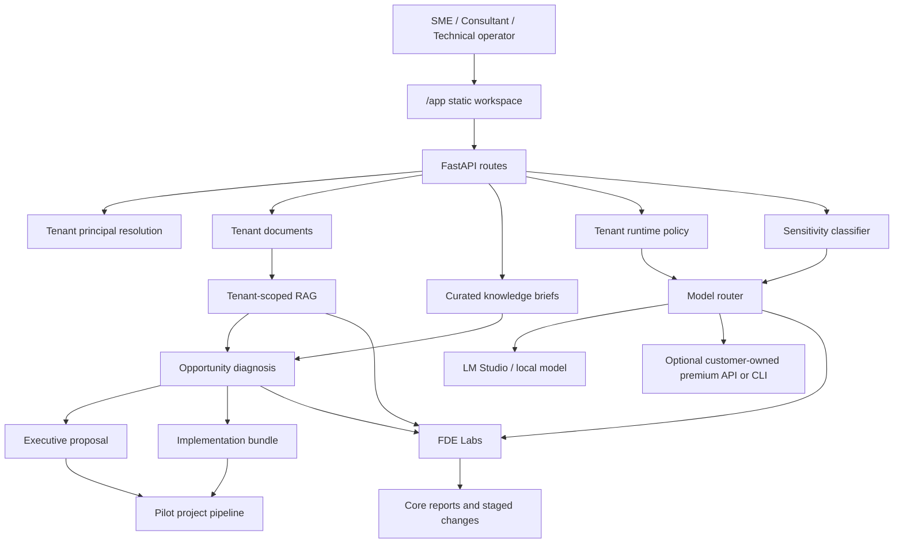
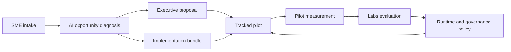

# Architecture

## Overview

VirtuDirector IA is a single FastAPI application with four major functional layers:

1. operator-facing workflows,
2. knowledge and retrieval infrastructure,
3. runtime control and delivery packaging,
4. the FDE Labs evaluation and promotion system.

## Top-level structure

```text
backend/app/
├── api/          HTTP routes
├── core/         orchestration, scoring, proposals, bundles, routing, runtime policy
├── ingest/       document parsing
├── knowledge/    curated knowledge ingestion, compaction, retrieval
├── labs/         experiment execution, report lifecycle, change promotion
├── rag/          embeddings, retriever, store
├── security/     audit, PII utilities, sensitivity classification
├── static/       web UI assets
└── tools/        web search, LM Studio, and premium CLI integrations
```

## System diagram



## Product flow



## Request flow

### Chat and opportunity workflows

1. The request enters through `routes_chat.py` or `routes_opportunities.py`.
2. `deps.py` resolves the tenant principal.
3. `core/orchestrator.py` and related modules fetch platform knowledge and client RAG context.
4. Deterministic scoring logic runs in Python.
5. Model routing, sensitivity checks, and optional premium escalation enrich the response.
6. The route returns either JSON or SSE.

### Executive proposal and implementation bundle workflows

1. The request enters through `routes_opportunities.py`.
2. The route uses a tenant-scoped runtime policy.
3. `core/executive_proposals.py` or the implementation engine converts a ranked opportunity into a persisted artifact set.
4. The backend stores output under `data/executive_proposals/` or `data/implementation_bundles/`.
5. The UI consumes the response immediately and can also reuse the persisted files later.

### Knowledge ingestion

1. A file is uploaded to `/knowledge/updates`.
2. `knowledge/updates.py` parses and normalizes the content.
3. The system writes:
   - a raw update row,
   - a compact brief row.
4. Retrieval uses ranked brief selection rather than raw full-text lookup.

### Document ingestion

1. A file is uploaded to `/documents`.
2. `ingest/document_parser.py` extracts text.
3. `rag/ingest.py` chunks and embeds content.
4. The tenant-scoped store receives the resulting records.

### Labs execution

1. `/labs/experiments/run` calls `LabsService`.
2. The service instantiates one or more registered lab classes.
3. Each lab returns a `LabRunResult`.
4. Material improvements generate a `CoreReportDraft`.
5. Reports are stored and wait for human decision.
6. Approved reports create staged changes.
7. Staged changes can be applied and exposed as feature flags.

## Persistence model

Two persistence paths exist today:

### Local labs and knowledge persistence

- SQLite-based persistence through `core/db.py`
- default path: `data/virtudirector_labs.sqlite3`
- override path: `LABS_SQLITE_PATH`

### Configured infrastructure endpoints

The application exposes `DATABASE_URL` and `REDIS_URL` in settings, but the currently active lab and knowledge flows use the local SQLite path for the working repository behavior validated by the smoke and test suite.

## Knowledge ranking model

The knowledge layer uses compact briefs rather than full raw documents for ranking.

Ranking factors:

- folded, accent-insensitive matching,
- token overlap by weighted field,
- phrase boosts,
- sector alignment,
- block alignment,
- query intent inference,
- optional explanation metadata.

The knowledge explorer in `/app` uses this ranking layer to support:

- sector-specific quick wins,
- `local vs cloud` decisions,
- ROI and roadmap retrieval,
- governance and sensitivity lookups.

When `explain=true` is used on `/knowledge/briefs`, the API returns:

- `query_intent`
- `block`
- `score`
- `score_breakdown`
- `reasons`

## Authentication model

### Tenant access

- production: JWT bearer token
- development: `X-Tenant-Id` and `X-User-Id` headers

### Admin access

- HTTP Basic auth
- used by `/admin/labs` and `/labs/*`

## Static UI model

The repository serves two static UIs directly from FastAPI:

- `/app`: operator workspace
- `/admin/labs`: Labs administration panel

No Node or separate frontend build is required.

The `/app` workspace exposes three product modes:

- `SME`: guided diagnosis and executive proposal output,
- `Consultant`: bundle generation and intelligence exploration,
- `Technical`: runtime controls, sensitivity-aware escalation, and diagnostics.

## Design constraints

Important repository constraints:

- labs must be deterministic,
- labs must tolerate isolated evaluator failure,
- measured changes must not auto-promote,
- curated knowledge must remain versioned in git and importable into the local DB,
- local/LAN inference must be usable without changing the HTTP contract,
- premium escalation must remain optional and tenant-controlled,
- and executive outputs must be reproducible from deterministic diagnosis inputs.
